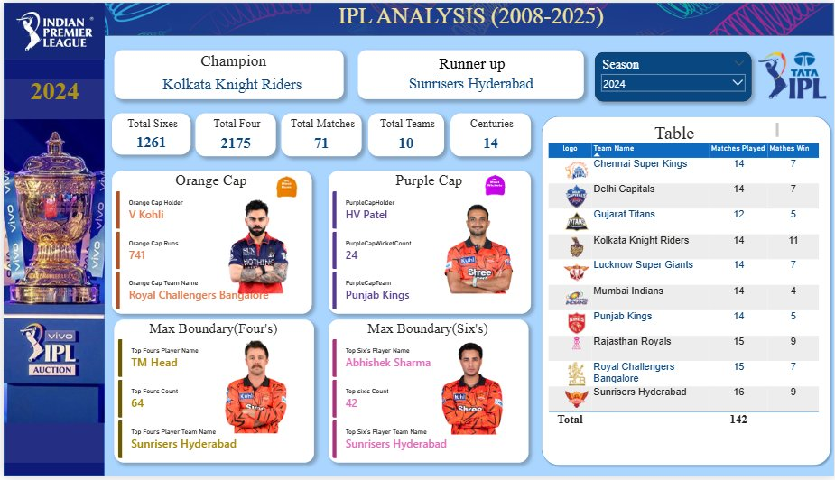

<div align="center">


# 🏏 IPL Analysis Dashboard (2008–2025)

**An interactive Power BI Dashboard covering all IPL seasons from 2008 to 2025**  
Dynamic, season-wise insights into match results, player awards, team performance, and boundary statistics.

[](https://powerbi.microsoft.com/)
[]()
[]()
[]()

</div>

---

## 📸 Dashboard Preview

<div align="center">

> **Season 2024 — Kolkata Knight Riders won the Championship**



*Interactive season slicer · KPI cards · Orange & Purple Cap · Points Table · Boundary Leaders*

</div>

---

## 💡 Key Insights — IPL 2025

<div align="center">

| Metric | Value |
|--------|-------|
| 🏆 Champion | **Royal Challengers Bangalore** |
| 🥈 Runner Up | Punjab Kings |
| 💥 Total Sixes | **1,296** |
| 🏏 Total Fours | **2,251** |
| 🎯 Total Matches | 74 |
| 💯 Centuries | 9 |
| 🟠 Orange Cap | **B Sai Sudharsan** — 759 Runs *(Gujarat Titans)* |
| 🟣 Purple Cap | **M Prasidh Krishna** — 25 Wickets *(Gujarat Titans)* |
| 4️⃣ Most Fours | **B Sai Sudharsan** — 88 Fours *(Gujarat Titans)* |
| 6️⃣ Most Sixes | **N Pooran** — 40 Sixes *(Lucknow Super Giants)* |

</div>

---

## 📁 Project Structure

```
IPL-Analysis-Dashboard/
│
├── 📊 IPL_Dashboard.pbix           # Power BI report file
│
├── 📂 Data/
│   ├── ball_by_ball_data.csv       # Delivery-level ball-by-ball data
│   ├── ipl_matches_data.csv        # Match-level data for all seasons
│   ├── players-data-updated.csv    # Player profiles with image URLs
│   └── teams_data.csv              # Team metadata with logo URLs
│
├── 📂 assets/
│   └── dashboard-preview.png       # Dashboard screenshot
│
└── 📄 README.md                    # Project documentation
```

---

## 📦 Data Sources

| File | Description | Key Columns |
|------|-------------|-------------|
| `ball_by_ball_data.csv` | Every delivery bowled across all IPL seasons | match_id, batter, bowler, batter_runs, is_wicket, wicket_kind |
| `ipl_matches_data.csv` | Match-level results and metadata | match_id, season, match_date, team1, team2, match_winner |
| `players-data-updated.csv` | Player profiles with hosted image URLs | player_name, player_image, team, role |
| `teams_data.csv` | Team names with logo image URLs | team_name, image_url, short_name |

---

## 📊 Dashboard Features

### 🔄 Season Slicer
Filter the **entire dashboard** by any IPL season from 2008 to 2025. All KPIs, caps, boundaries, and the points table update dynamically.

### 📈 KPI Cards
| KPI | Description |
|-----|-------------|
| Total Sixes | All sixes hit in the selected season |
| Total Fours | All fours hit in the selected season |
| Total Matches | Matches played in the selected season |
| Total Teams | Number of participating teams |
| Centuries | Individual batting centuries scored |

### 🟠 Orange Cap & 🟣 Purple Cap
- **Orange Cap** — Top run-scorer with player photo, name, total runs, and team
- **Purple Cap** — Top wicket-taker (bowler wickets only, excludes run-outs) with player photo, name, wicket count, and team

### 🏏 Max Boundary Leaders
- **Most Fours** — Player with the highest four count, with photo and team
- **Most Sixes** — Player with the highest six count, with photo and team

### 📋 Points Table
- Team-wise **Matches Played** and **Matches Won**
- Team logos rendered natively from hosted image URLs

---

## 🧮 DAX Measures

<details>
<summary><b>📐 Click to expand all DAX Measures</b></summary>

### 🏆 Season Winner
```dax
Season Winner =
VAR SelectedSeason = SELECTEDVALUE(ipl_matches_data[season])
VAR FinalMatchDate = CALCULATE(MAX(ipl_matches_data[match_date]),
                    ipl_matches_data[season] = SelectedSeason)
VAR FinalMatchWinner = CALCULATE(SELECTEDVALUE(ipl_matches_data[match_winner]),
                    ipl_matches_data[season] = SelectedSeason,
                    ipl_matches_data[match_date] = FinalMatchDate)
RETURN FinalMatchWinner
```

### 🖼️ Season Winner Logo
```dax
Season winner Logo =
VAR SelectedSeason = SELECTEDVALUE(ipl_matches_data[season])
VAR FinalMatchDate = CALCULATE(MAX(ipl_matches_data[match_date]),
                    ipl_matches_data[season] = SelectedSeason)
VAR FinalMatchWinner = CALCULATE(SELECTEDVALUE(ipl_matches_data[match_winner]),
                    ipl_matches_data[season] = SelectedSeason,
                    ipl_matches_data[match_date] = FinalMatchDate)
RETURN LOOKUPVALUE(teams_data[image_url], teams_data[team_name], FinalMatchWinner)
```

### 💥 Total 6's
```dax
Total 6's =
CALCULATE(COUNTROWS(ball_by_ball_data), ball_by_ball_data[batter_runs] = 6,
          KEEPFILTERS(VALUES(ipl_matches_data[season])))
```

### 🟠 Orange Cap Holder
```dax
Orange Cap Holder =
VAR SelectedSeason = SELECTEDVALUE(ipl_matches_data[season])
VAR SeasonDataOnly = FILTER(ball_by_ball_data, RELATED(ipl_matches_data[season]) = SelectedSeason)
VAR RunSummary = SUMMARIZE(SeasonDataOnly, ball_by_ball_data[batter], "Total Runs", SUM(ball_by_ball_data[batter_runs]))
VAR MaxRuns = MAXX(RunSummary, [Total Runs])
VAR TopScorer = CALCULATETABLE(VALUES(ball_by_ball_data[batter]), FILTER(RunSummary, [Total Runs] = MaxRuns))
RETURN MAXX(TopScorer, ball_by_ball_data[batter])
```

### 🟣 Purple Cap Holder
```dax
PurpleCapHolder =
VAR SelectedSeason = SELECTEDVALUE(ipl_matches_data[season])
VAR SeasonWickets = FILTER(ball_by_ball_data,
    RELATED(ipl_matches_data[season]) = SelectedSeason &&
    ball_by_ball_data[is_wicket] = TRUE() &&
    NOT ball_by_ball_data[wicket_kind] IN { "run out", "retired hurt", "obstructing the field", "retired out" })
VAR WicketSummary = SUMMARIZE(SeasonWickets, ball_by_ball_data[bowler],
    "WicketCount", COUNTROWS(FILTER(SeasonWickets, ball_by_ball_data[bowler] = EARLIER(ball_by_ball_data[bowler]))))
VAR MaxWickets = MAXX(WicketSummary, [WicketCount])
VAR TopBowler = CALCULATETABLE(VALUES(ball_by_ball_data[bowler]), FILTER(WicketSummary, [WicketCount] = MaxWickets))
RETURN MAXX(TopBowler, ball_by_ball_data[bowler])
```

### 📋 Matches Played (Points Table)
```dax
Matches Played =
VAR SelectedSeason = SELECTEDVALUE(ipl_matches_data[season])
VAR Team1Matches = CALCULATE(COUNTROWS(ipl_matches_data),
    USERELATIONSHIP(ipl_matches_data[team1], teams_data[team_name]),
    ipl_matches_data[season] = SelectedSeason,
    ipl_matches_data[match_type] = "T20")
VAR Team2Matches = CALCULATE(COUNTROWS(ipl_matches_data),
    USERELATIONSHIP(ipl_matches_data[team2], teams_data[team_name]),
    ipl_matches_data[season] = SelectedSeason,
    ipl_matches_data[match_type] = "T20")
RETURN Team1Matches + Team2Matches
```

### 🏅 Matches Won (Points Table)
```dax
Matches Won =
VAR SelectedSeason = SELECTEDVALUE(ipl_matches_data[season])
VAR CurrentTeam = SELECTEDVALUE(teams_data[team_name])
RETURN CALCULATE(COUNTROWS(ipl_matches_data),
    ipl_matches_data[season] = SelectedSeason,
    ipl_matches_data[match_winner] = CurrentTeam,
    ipl_matches_data[match_type] = "T20")
```

</details>

---

## ⚙️ Technical Implementation

### Data Modelling
- `ipl_matches_data` is the central **fact table**
- `ball_by_ball_data` linked via `match_id`
- `teams_data` and `players-data-updated` are **dimension tables**
- `USERELATIONSHIP` used for Points Table (team1 & team2 are separate columns requiring two inactive relationships)

### Image Integration
- Player and team images use **publicly hosted URLs** from `documents.iplt20.com`
- `image_url` and `player_image` columns set to **Data Category: Image URL** in the Modeling tab
- Images render natively inside Power BI Table and Card visuals

### Purple Cap — Special Filter Logic
Excludes non-bowler dismissals using `NOT IN`:
```
"run out", "retired hurt", "retired out", "obstructing the field", "timed out"
```

---

## 🚀 How to Use

1. **Clone or download** this repository
   ```bash
   git clone https://github.com/your-username/IPL-Analysis-Dashboard.git
   ```
2. Open `IPL_Dashboard.pbix` in **Microsoft Power BI Desktop**
3. If prompted, update the **data source path** to point to your local `/Data/` folder
4. Click **Refresh** to load the data
5. Use the **Season slicer** to explore any IPL season from **2008 to 2025**

---

## 📌 Requirements

- Microsoft Power BI Desktop (latest version recommended)
- Internet connection (for image URLs to render)
- All 4 CSV files placed in the correct data source path

---

## 🛠️ Tools & Technologies

| Tool | Purpose |
|------|---------|
| Microsoft Power BI Desktop | Dashboard development & visualizations |
| DAX | Dynamic measure calculations & KPIs |
| Power Query (M) | Data import, transformation & cleaning |
| CSV Files | Primary data source |
| Image URLs | Team logos & player photos |

---

## 🙌 Acknowledgements

- IPL match data sourced from public cricket datasets
- Team logos and player images from [iplt20.com](https://www.iplt20.com)

---

## 📄 License

This project is for **educational and portfolio purposes only.**  
IPL data and logos are the property of their respective owners.

---

<div align="center">

⭐ **If you found this project useful, please star the repository!** ⭐

</div>
